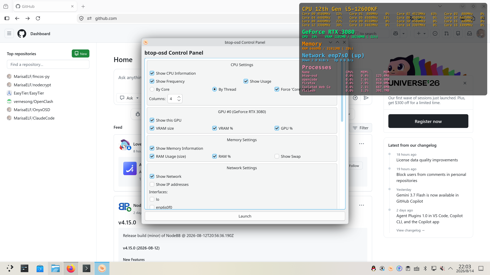

# btop-osd

一个运行在 Wayland 上的系统状态 OSD（屏幕显示）覆盖层，灵感来源于
[OnyxOSD](https://github.com/ItzGreenCat/OnyxOSD)，数据采集复用
[btop](https://github.com/aristocratos/btop) 的本地采集器，使用 Qt 6 实现。

OSD 是一个基于 `wlr-layer-shell` 的悬浮窗口：半透明、鼠标穿透、始终置顶，
可显示 CPU、内存、多张 GPU、所选网卡以及 CPU 占用最高的进程列表。





## 功能特性

- 基于 `LayerShellQt` 的 Wayland 悬浮 OSD，鼠标点击穿透，始终置顶。
- 控制面板 + 系统托盘图标：单击托盘图标停止 OSD 并重新打开面板。
- 实时预览：程序启动时以及每次更改任意表单项后，都用新配置渲染一次并显示。
- 可选分区（每个均可独立开关）：
  - CPU：按线程 / 按物理核心的网格、频率、占用率、列数。
  - GPU：每个检测到的显卡一个区块（NVIDIA / AMD / Intel），各自独立控制
    占用率、显存容量、显存百分比。
  - 内存：已用 / 总量 + 百分比，可选交换分区。
  - 网络：选择要显示的网卡，可选显示 IP 地址。
  - 进程：CPU 占用最高的前 N 个进程，显示名称 + CPU% + 内存% + 内存大小（可开关）。
- 外观设置：
  - 窗口位置（左上 / 右上 / 左下 / 右下）与刷新间隔。
  - 层模式（悬浮置顶 / 底层）。
  - 字体大小、加粗、字体透明度。
  - 各分区标题颜色、背景颜色、背景透明度。
  - OSD 窗口到屏幕边缘的左右 / 上下边距。
- 设置通过 `QSettings` 持久化，颜色以 `#RRGGBB` 十六进制字符串保存，方便手动编辑配置文件。

## 与 OnyxOSD 的不同之处

- **平台**：OnyxOSD 是 Windows 上的 Java 覆盖层；btop-osd 面向 Linux / Wayland，
  使用 `wlr-layer-shell` 实现悬浮与鼠标穿透。
- **数据来源**：OnyxOSD 自行采集数据；btop-osd 直接复用 btop 的原生采集器，
  因此原生支持多 GPU、每核 CPU 频率/占用、进程内存等 Linux 数据。
- **实时预览**：配置面板中每次修改都会即时渲染一次 OSD 效果，所见即所得。
- **配置友好**：颜色等设置以明文十六进制写入配置文件，可直接手动编辑。
- **开机自启**：提供 `autorun` 命令行参数，直接启动 OSD 而不显示控制面板。

## 环境要求

- 支持 `wlr-layer-shell` 协议的 Wayland 合成器（KDE / KWin、Sway、Hyprland、
  river 等）。
- Qt 6、`LayerShellQt`（`qt6-layershell`）、`fmt`。

### 安装 LayerShellQt（依赖）

Arch / CachyOS：

```
sudo pacman -S qt6-layershell
```

其他发行版请安装对应的 Qt 6 LayerShell 包（如 Fedora 的 `qt6-qtwaylandlayershell`、
openSUSE 的 `qt6-wayland-layer-shell` 等），或从上游源码构建：
<https://github.com/wayland-frontend/layer-shell-qt>。

## 依赖与编译（Arch / pacman）

```
sudo pacman -S base-devel cmake qt6-base qt6-layershell fmt
```

可选：读取 GPU 所需的运行时库

- NVIDIA：`nvidia-utils`（提供 `libnvidia-ml.so`）
- AMD：`rocm-smi-lib`（提供 `librocm_smi64.so`）；缺失时消费级 / APU 显卡
  会回退到 btop 的 AMD sysfs 方案。
- Intel：无需额外包（使用内核 PMU / sysfs）。

编译：

```
cmake -S . -B build -DCMAKE_BUILD_TYPE=Release
cmake --build build -j
```

## 运行

普通模式（先打开控制面板）：

```
./build/btop-osd
```

开机自启（直接启动 OSD，不显示面板）：

```
./build/btop-osd autorun
```

使用说明：

- 控制面板中勾选要显示的分区，调整外观后按 **Launch** 启动 OSD。
- 修改任意表单项时，OSD 会实时预览当前效果（不做周期刷新）。
- 单击托盘图标停止 OSD 并回到面板；右键托盘图标 → **Quit** 退出。

## 配置

配置文件由 `QSettings` 写入，位置取决于发行版（通常为
`~/.config/btop-osd/btop-osd.conf`）。颜色以 `#RRGGBB` 形式存储，例如：

```ini
color/cpu=#DAA520
color/background=#000000
osd/bgOpacity=60
osd/marginLR=10
osd/marginTB=10
```

## 项目结构

```
src/
├── main.cpp                 # 程序入口：面板 + 托盘 + OSD 联动 + autorun 参数
├── osdwidget.{h,cpp}        # LayerShell 悬浮组件（渲染各行文本）
├── osdengine.{h,cpp}        # 封装 btop 采集器，生成文本行
├── controlpanel.{h,cpp}     # 设置面板 + QSettings 持久化
├── config.{h,cpp}           # 配置结构与读写
├── resources.qrc            # 内嵌 src/icon.png
└── btop/                    # 内嵌的 btop 采集代码（未修改）
    ├── btop_tools.* btop_shared.* btop_config.hpp btop_log.hpp
    ├── btop_log_impl.cpp    # 极简 Logger（stderr）
    ├── btop_config_impl.cpp # 极简 Config maps（采集器可调项）
    ├── btop_globals_impl.cpp# btop 全局 / 布局状态定义
    └── linux/btop_collect.cpp + linux/intel_gpu_top/   # Linux 采集器
```

只内嵌了 btop 的数据采集代码，未使用任何 btop 的渲染代码；采集代码原样编译，
由少量胶水文件（`btop_log_impl.cpp`、`btop_config_impl.cpp`、
`btop_globals_impl.cpp`）提供采集器所需符号，不引入 btop TUI。
